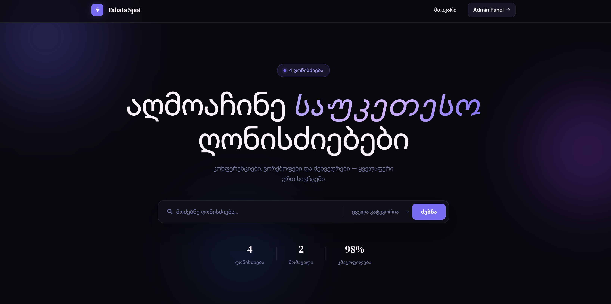
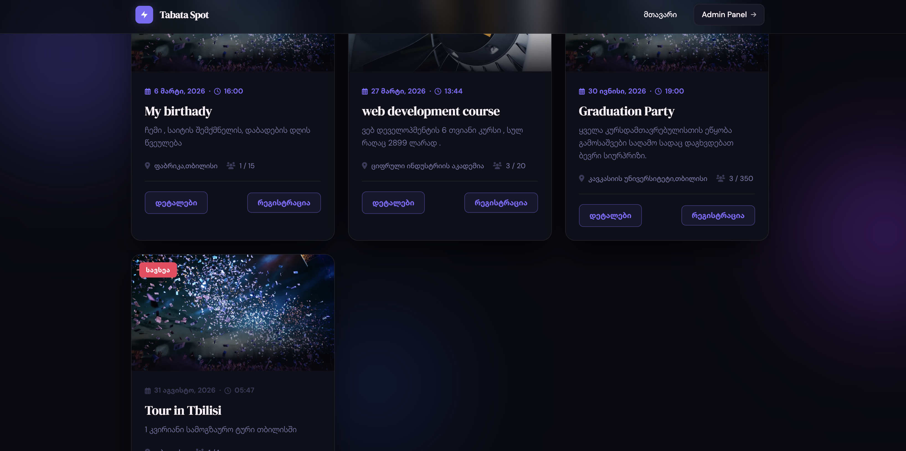
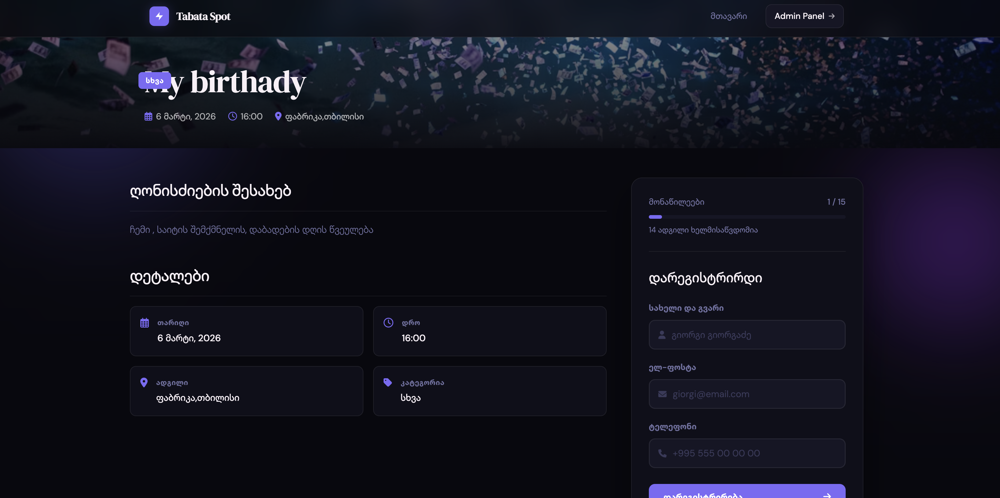
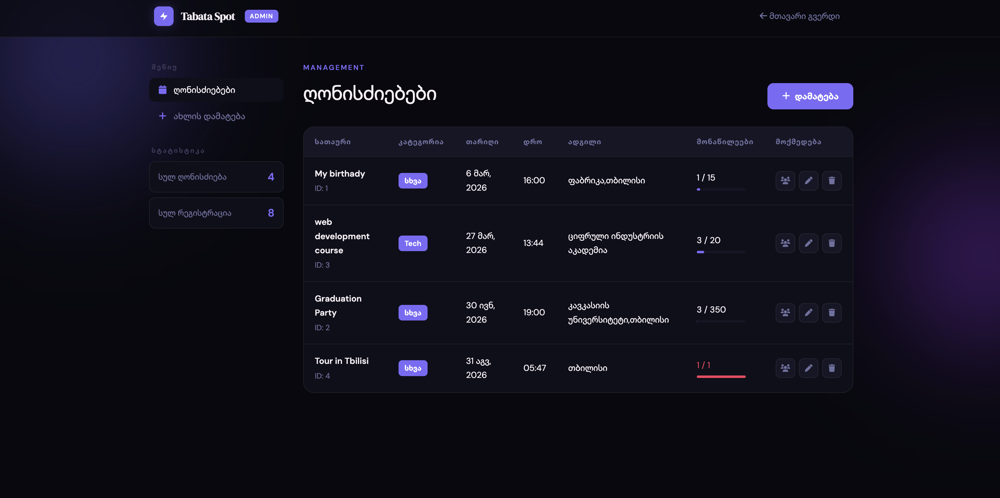
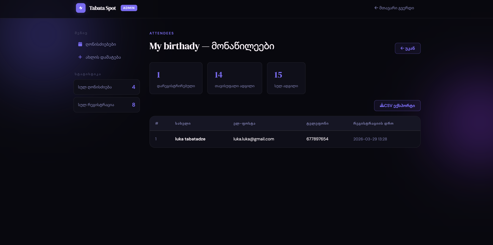

# 📍 Tabata Spot — Event Management Platform

Tabata Spot არის თანამედროვე Full-stack პლატფორმა ღონისძიებების აღმოჩენის, რეგისტრაციისა და ადმინისტრირებისთვის. პროექტი ფოკუსირებულია სისწრაფეზე, სიმარტივესა და მონაცემთა ეფექტურ მართვაზე.

##
# 🛠 ტექნოლოგიური სტეკი
Backend: Node.js (Express)

Database: SQLite (გამოყენებულია ჩაშენებული node:sqlite მოდული)

Frontend: Clean HTML5, CSS3 (Custom Properties), Vanilla JavaScript

API: RESTful Architecture

## მოთხოვნები

- [Node.js](https://nodejs.org/) **22.5+** (რეკომენდებული: 22 LTS ან 24; საჭიროა `node:sqlite` API)

## ბაზის ინიციალიზაცია

1. Backend ფოლდერში დააყენეთ დამოკიდებულებები:
   ```bash
   cd backend
   npm install
   ```
2. სერვერის პირველ გაშვებაზე **`backend/events.db`** ფაილი შეიქმნება ავტომატურად და გაშვებული იქნება SQL სქემა (ცხრილები + უნიკალური ინდექსი `eventId` + `lower(email)` მონაწილის ელფოსტაზე).
3. თუ ძველი ბაზა გაქვთ და ინდექსი ვერ ემატება, წაშალეთ `events.db` და ხელახლა გაუშვით სერვერი.

```bash
cd backend
npm start
```

სერვერი: **http://localhost:3000**

## Frontend-ის გახსნა

ბრაუზერში გახსენით `frontend/index.html` (ან გამოიყენეთ Live Server / `npx serve frontend`). API მისამართი კონფიგურირებულია როგორც `http://localhost:3000/api` — backend სავალდებულოდ უნდა იყოს გაშვებული.

## API დოკუმენტაცია

### Events

| მეთოდი | URL | აღწერა |
|--------|-----|--------|
| `GET` | `/api/events` | ყველა ღონისძიება. Query: `search` (title), `category`, `sort` (`asc` \| `desc`), `when` (`upcoming` \| `past`). პასუხში თითო ჩანაწერს აქვს `registeredCount`, `spotsLeft`. |
| `GET` | `/api/events/:id` | ერთი ღონისძიება + `registeredCount`, `spotsLeft`. |
| `POST` | `/api/events` | შექმნა. Body (JSON): `title`, `description`, `date`, `time`, `location`, `category`, `capacity`. |
| `PUT` | `/api/events/:id` | განახლება (იგივე ველები). `capacity` არ უნდა იყოს ნაკლები არსებული რეგისტრაციების რაოდენობაზე. |
| `DELETE` | `/api/events/:id` | წაშლა + დაკავშირებული რეგისტრაციები. |

### Registrations

| მეთოდი | URL | აღწერა |
|--------|-----|--------|
| `POST` | `/api/events/:id/register` | Body: `fullName`, `email`, `phone`. წარმატება: `201` + `confirmationCode`. `409`: `error: duplicate_email` ან `capacity_full`. |
| `GET` | `/api/events/:id/attendees` | მონაწილეების სია + `event`, `total`, `spotsLeft`. |

სტატუს კოდები: `400` — ვალიდაცია, `404` — ვერ მოიძებნა, `409` — ბიზნეს-კონფლიქტი (სავსე / დუბლიკატი), `201` — შექმნა.

## დემო სკრინშოტები (ჩასაბარებლად)

## Demo








## პროექტის სტრუქტურა

```
backend/
  server.js
  database.js
  routes/events.js
  routes/registrations.js
  package.json
frontend/
  index.html
  event.html
  admin.html
  style.css, event.css, admin.css
```

## რეალიზებული / ბონუს ფუნქციები

- რეგისტრაციის დასტურის კოდი (`REG-…`)  
- მომავალი / წარსული ღონისძიებების ფილტრი (`when`)  
- მონაწილეთა რაოდენობა ბარათებზე და ადმინ ცხრილში  
- მისამართების CSV ექსპორტი  
- ძებნის ბოლო მნიშვნელობა `localStorage`-ში (მთავარ გვერდზე)  

---

დავალების ფარგლებში: README, ბაზის ინსტრუქცია, API აღწერა და ადგილი სკრინშოტებისთვის — ყველაფერი ზემოთ მოცემულია.
